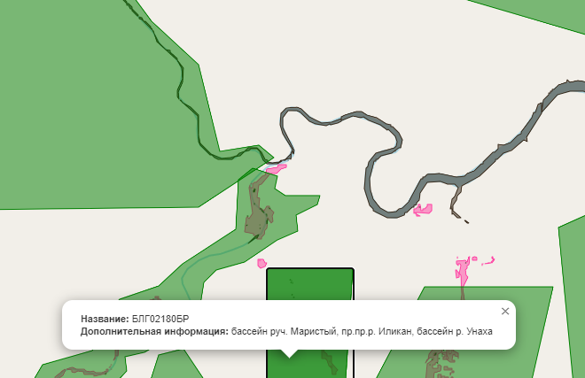
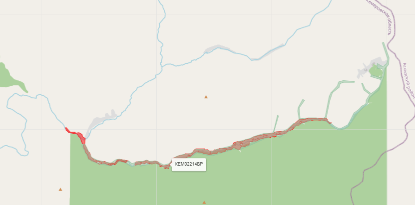

## Описание проекта
 
В данном репозитории находятся скрипты для:
1. **Увеличения набора данных** (data augmentation) спутниковых снимков и соответствующих им масок:
   - Разбиения изображений на блоки,
   - Вырезания нужных объектов и наложения их на новые участки,
   - Применения различных трансформаций (Flip, GridDistortion, ElasticTransform и т. д.).
2. **Обучения LoRA (Low-Rank Adaptation) на основе модели Stable Diffusion** (в файле `stable.py`).
3. **Предсказания** нна спутниковых снимках   для выявления загрязнений из-за добычи полезных ископаемых.

## Структура проекта

```bash
├── data_increases/
│   ├── satellite_image_processing.py
│   └── stable.ipynb
├── prediction.ipynb
├── README.md
```

### 1. Папка `data_increases`

#### 1.1. `satellite_image_processing.py`
В этом файле может находиться код, который:
- Берёт большие спутниковые снимки и соответствующие маски,
- Разбивает их на блоки (`block_size` x `block_size`),
- Проверяет каждый блок на «пустоту»/«непустоту» (по количеству ненулевых пикселей),
- Сохраняет блоки и маски в соответствующие директории,
- Вырезает объекты (по bounding box) и сохраняет в `cropped_images` / `cropped_masks` для дальнейшего наложения,
- При необходимости использует **albumentations** (Flip, ElasticTransform, GridDistortion, Affine и т. д.) для аугментации.

#### 1.2. `stable.py`
В этом файле представлен **основной скрипт для обучения LoRA** (Low-Rank Adaptation) на базе **Stable Diffusion**:
- Использует следующие библиотеки: `torch`, `diffusers`, `accelerate`, `peft`, `pandas`, `scikit-learn` и т. д.
- Инициализирует `Accelerator` для эффективного обучения (с возможностью распределённого обучения или без смешанной точности).
- Загружает исходную модель Stable Diffusion (например, `runwayml/stable-diffusion-v1-5`).
- Настраивает LoRA-адаптеры для UNet (с помощью `peft.LoraConfig`).
- Считывает датасет из изображений и текстовых подписей (`captions.csv`), разбивает его на обучающую и валидационную часть.
- Выполняет тренировочный цикл с вычислением MSE-потерь между предсказанным шумом и реальным.
- Сохраняет обученные LoRA-веса в директорию `output_dir`.

В самом конце кода также приведён пример, **как загрузить модель Stable Diffusion и LoRA-веса** (файл с расширением `.safetensors` или `.bin`), а затем сгенерировать несколько изображений с помощью уже обученных LoRA-весов.

### 2.  `prediction`
1. **Загрузки** обученной модели модели для сегментации объектов:

2. **Предобработки** входных спутниковых снимков:
   - Нормализация каналов ,
   - Разделение больших снимков на тайлы (`block_size` x `block_size`),
   - Геопривязка: чтение метаданных через `rasterio` и сохранение их для последующей векторизации результатов.

3. **Выполнения инференса** :
   - **instance segmentation** и выделение областей (например, воды, растительности, территорий золотодобычи, загрязнений),  
   - При необходимости — **дополнительные расчёты** индексов (NDVI, NDWI, NDMI и т. д.), позволяющие оценить состояние растительности или степень загрязнения воды,
   - **Выявление нарушений** (например, сопоставление найденных областей золотодобычи с лицензионными границами, вычисление расстояния до рек и т. п.).

4. **Нанесения результатов** инференса на **интерактивную карту** с помощью **Folium**:
   - Создание объекта карты `folium.Map` с центром в целевой зоне (координаты высчитываются, к примеру, по центроиду исследуемой области),
   - Добавление слоёв с предсказанными полигонами (воды, растительности, нарушений и т. п.) в виде `GeoJson`,
   - Создание всплывающих окон (popups) или подсказок (tooltips) с дополнительной информацией о каждом объекте (класс, площадь, координаты и пр.),
   - Сохранение итоговой карты в формате HTML для последующего просмотра в браузере.
 ### Результат
 

 